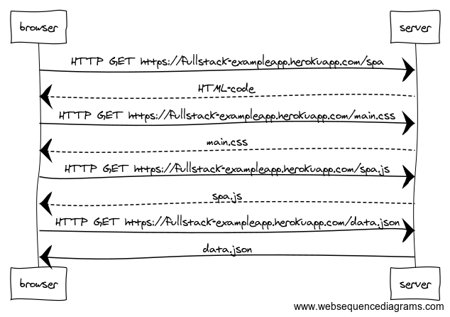
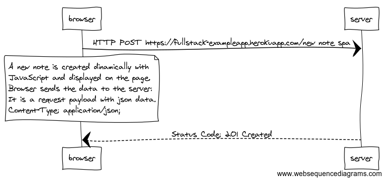

# Part 0 - Exercises 0.4, 0.5, and 0.6

## Exercise 0.4

User creates a new note on page https://fullstack-exampleapp.herokuapp.com/notes by writing something into the text field and clicking the submit button.

***

## Exercise 0.5

User goes to the single page app version of the notes app at https://fullstack-exampleapp.herokuapp.com/spa.

Opening the SPA in this case is similar to the default app version.
The browser will send the HTTP requests to get the data for the HTML, and then the CSS, JS, and JSON,

***

## Exercise 0.6

User creates a new note using the single page version of the app.

As explained, in the SPA version of the APP, the form element has no action or method attributes.
The JavaScript file generates a new note to be displayed for the users in the list element and also uses e.preventDefault() to prevent the form action and a browser refresh. Then it sends the JSON data to the server.
